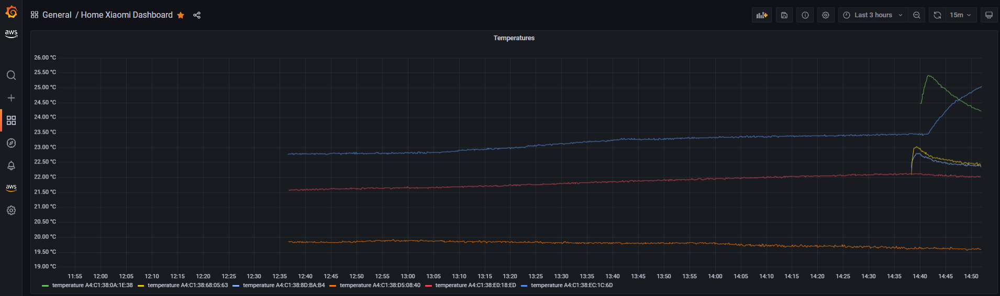
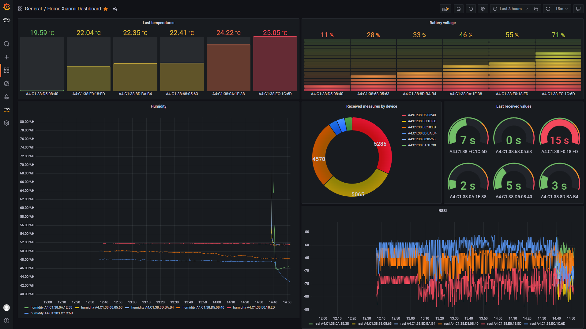

# Cloud - AWS

## Grafana Dashboard:




## Spec
Payloads on topic : `caniot_controller/data`

```
{
  "bt_mac": "A4:C1:38:0A:1E:38",
  "timestamp": 1663419649,
  "measures": {
    "rssi": -59,
    "temperature": "23.83",
    "humidity": 4700,
    "battery_level": 45,
    "battery_voltage": 2613
  }
}
```

## Grafana queries samples:

```sql
SELECT bt_mac, CREATE_TIME_SERIES(time, CAST(measure_value::varchar AS DOUBLE)) as temperature
FROM $__database.$__table
WHERE $__timeFilter AND measure_name='$__measure'
GROUP BY bt_mac
ORDER BY bt_mac
```


```sql
SELECT bt_mac, MAX_BY(measure_value::bigint, time) as battery 
FROM $__database.$__table WHERE measure_name='$__measure'
GROUP BY bt_mac
ORDER BY battery
```

```sql
SELECT bt_mac, COUNT(*) as COUNT
FROM $__database.$__table
WHERE $__timeFilter
GROUP BY bt_mac
```

```sql
SELECT bt_mac, date_diff('second', MAX(time),  now()) as last_sec
FROM $__database.$__table
GROUP BY bt_mac
```
